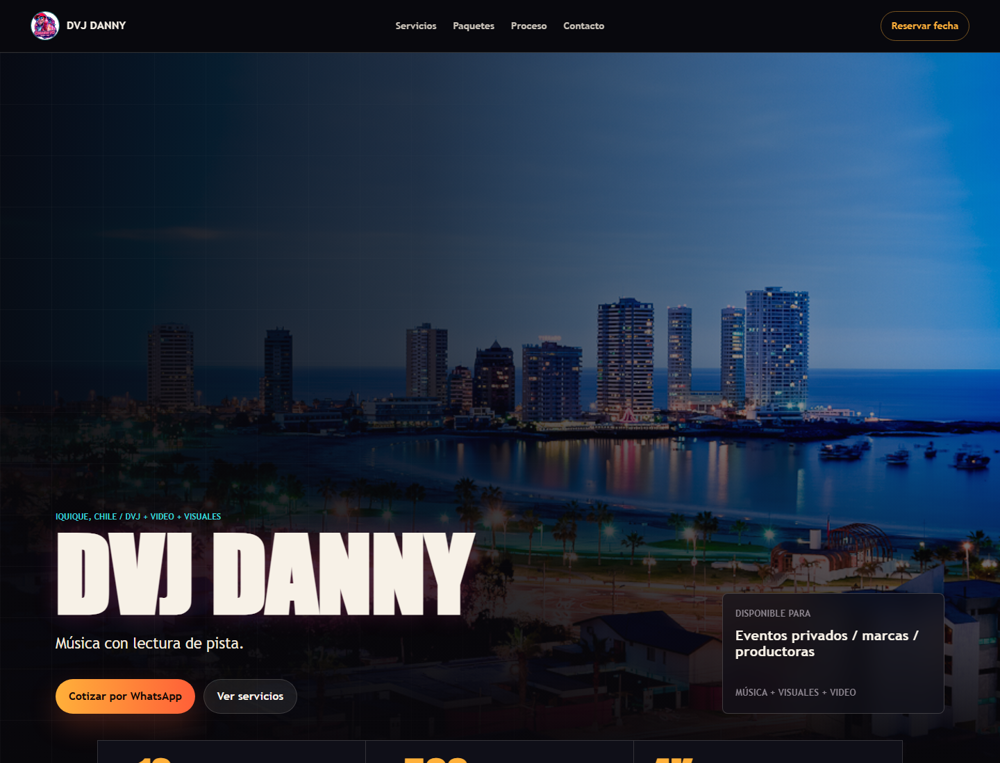

# DVJ Danny

Página oficial de DVJ Danny, proyecto musical y audiovisual enfocado en eventos, visuales en vivo y edición de video en Iquique, Chile.

## Sitio Web

https://dvjdanny.vercel.app

## Vista Previa

## Sobre El Proyecto

Este sitio presenta la identidad, servicios y propuesta de DVJ Danny en una experiencia directa, visual y orientada al contacto.

La página está pensada para personas, marcas y productoras que necesitan un servicio capaz de unir música, lectura de pista, puesta en escena y criterio audiovisual para eventos privados, matrimonios, celebraciones, activaciones y contenido para redes.

## Servicios Presentados

- DVJ para eventos.
- Visuales en vivo.
- Edición audiovisual.
- Resúmenes de eventos.
- Contenido vertical para redes sociales.
- Propuestas para eventos privados, marcas y productoras.

## Tecnologías

- Python
- Flask
- Jinja
- CSS
- OpenAPI / Swagger UI
- Vercel

## Producción

El sitio está desplegado en Vercel y disponible públicamente en:

https://dvjdanny.vercel.app

## Estado

Primera versión pública de la página oficial de DVJ Danny.
